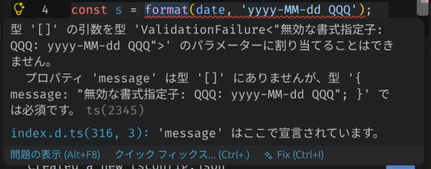

# Temporal用の解析/シリアライズ関数

これはJavaScriptで日付や時刻を扱うための実装で、Temporalのインスタンスを文字列へシリアライズ/解析するための関数を提供するパッケージです。

## インストール

```bash
npm install temporal-format
```

## 使い方

```ts
import { format, parse } from 'temporal-format';

const value = Temporal.ZonedDateTime.from(
    '2024-01-02T03:04:05+09:00[Asia/Tokyo]',
);

const text = format(value, 'yyyy/MM/dd HH:mm:ss');
console.log(text); // 2024/01/02 03:04:05

const parsed = parse('2024/01/02 03:04:05', 'yyyy/MM/dd HH:mm:ss');
console.log(parsed.toString());
```

> Temporal APIを利用できる環境(Node.js 20+、ブラウザ、または polyfill)でご利用ください。

書式文字列は[ICUのDate/Time Format Syntax](https://unicode-org.github.io/icu/userguide/format_parse/datetime/#datetime-format-syntax)のサブセットで、使用頻度が高いと思われる部分を厳選して実装しています。

## 不適切な書式文字列

不適切な書式文字列は型関数で検査されるため、TypeScriptのコンパイルエラーになります。

たとえば、`QQQ`のようにサポートされていないトークンを含む文字列を渡すと、VS Code上で次のようなエラーが表示されます。



このチェックは型レベルで行われるため、開発中に問題を早く見つけられます。

## 言語切り替え

表示されるエラーメッセージはデフォルトでは英語ですが、次のように記述したファイルをTypeScriptのコンパイル対象となる位置に置くと、コンパイルエラーのメッセージが日本語になります。

```ts
declare global {
  namespace NodeJS {
    interface ProcessEnv {
        TEMPORAL_FORMAT_LANG: 'ja';
    }
  }
}
```

実行時に使用されるメッセージは、実行時の環境変数`TEMPORAL_FORMAT_LANG`の値が`ja`のとき、日本語になります。

コンパイルエラーでのメッセージと、実行時のメッセージをそれぞれ異なる言語で表示することもできます。

## 仕様

- [format](docs/functions/format.md)
- [parse](docs/functions/parse.md)
- [書式文字列](docs/type-aliases/FormatString.md)

## ライセンス

MIT
